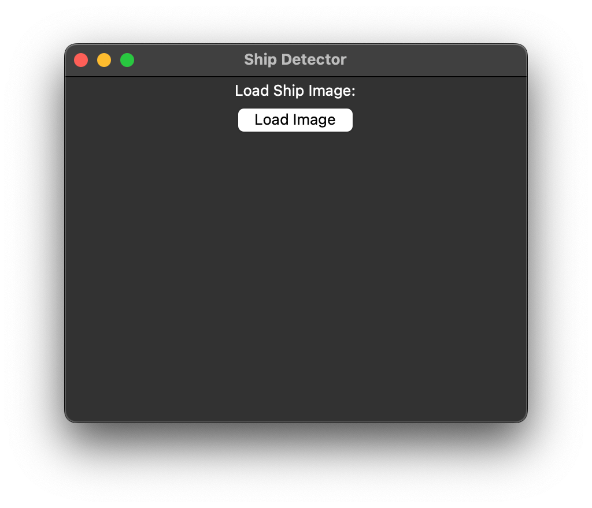

# airbus-segmentation

Semantic segmentation model for [Airbus Ship Detection Challenge](https://www.kaggle.com/c/airbus-ship-detection/overview).

### How to launch and test an application:
1. Clone repository with the git clone command.
2. Add Python Interpreter (I used python3.10).
3. Activate venv (for MacOS: `source <venv>/bin/activate` command, for Windows: `<venv>\Scripts\activate.bat`).
4. Install libraries using requirements.txt: `pip install -r /path/to/requirements.txt`.

*Note! If you have MacOS M1 - you need to pip install tensorflow-macos in addition to requirements.*

5. Go to ui.py file and run that file (`python /path/to/ui.py`)
You'll see window for selecting an image:

6. Click on "Load image" and select image you wanted to test

7. And you'll get the result

### Project structure

- model folder - fitted unet neural network model
- train folder - stored preprocessed images and masks
- model_inference.py file - functions for inference
- model_training.py file - .py file for training (especially I was testing in google colab because of my computer configs) 
- EDA_airbus.ipynb file - EDA file (missing values, distributions, counts, data preprocessing) - output of this file are two .npy files stored in train folder 
- Airbus_training.ipynb - [Collab notebook](https://colab.research.google.com/drive/11QgPSMeaW-ycA4qvfppzb9PbHX3qT7d0?usp=sharing) for training (used this for training because of GPU available in google colab)
- [Colab folder](https://colab.research.google.com/drive/11QgPSMeaW-ycA4qvfppzb9PbHX3qT7d0?usp=sharing) with model and test images